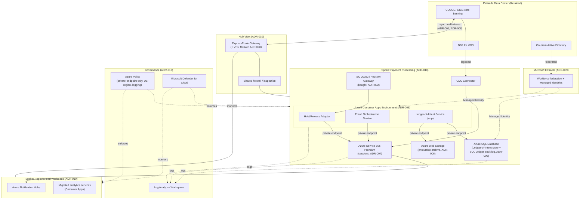

# Diagram: Azure Implementation Architecture (Step 6)

Source of truth for the Step 6 deployment diagram referenced in [`docs/azure-implementation.md`](../docs/azure-implementation.md) and [ADR-005](../adr/ADR-005-azure-compute-platform.md) through [ADR-010](../adr/ADR-010-azure-landing-zone-and-segmentation.md). Where [`diagrams/target-architecture-style.md`](target-architecture-style.md) (Step 4) and [`diagrams/logical-architecture.md`](logical-architecture.md) (Step 5) are vendor-neutral, this diagram is the first one in this case study to name real Azure services — it shows where each Step 5 logical component actually runs, and how the landing zone is segmented. Rendered as Mermaid (diagrams-as-code, renders natively on GitHub); a hand-drawn version matching the visual style of Case Studies 1 and 3 can be layered in later.

## How to read this diagram

- **On-prem box stays exactly as in [`docs/current-state.md`](../docs/current-state.md)** — nothing about the mainframe changes as part of this step; only its two connection points (the sync hold call and the CDC read) are shown crossing into Azure.
- **Hub VNet** carries only shared connectivity and inspection — no workload runs here. This is what makes the two spokes independently governable.
- **Two spokes, two risk profiles** — the payment-processing spoke (new-build, real-time, BSA/AML-scoped) and the Replatformed-workloads spoke (the 2021 AWS-equivalent estate, migrated in under this same landing zone's governance) are segmented from each other, not just from the outside world, per [ADR-010](../adr/ADR-010-azure-landing-zone-and-segmentation.md).
- **Every dotted line is identity, policy, or observability** — none of these carry payment data; they are the governance layer this case study's landing zone adds that the 2021 ad hoc AWS account never had.
- **Private-endpoint-only** — the solid lines from Container Apps to Service Bus and Azure SQL Database are private-endpoint connections inside the spoke VNet; nothing here is reachable from the public internet, consistent with the Network and Security Summary in [`docs/azure-implementation.md`](../docs/azure-implementation.md).
