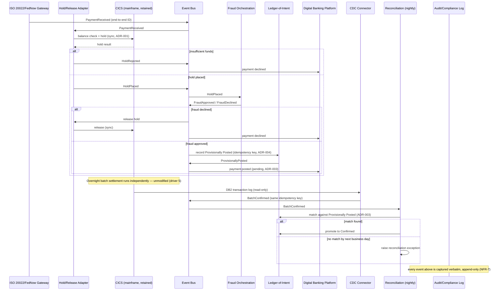

# Diagram: Logical Architecture — Real-Time Payment Sequence (Step 5)

Source of truth for the Step 5 logical-design sequence diagram referenced in [`docs/logical-design.md`](../docs/logical-design.md), [ADR-003](../adr/ADR-003-provisional-vs-confirmed-state-model.md), and [ADR-004](../adr/ADR-004-idempotency-and-exactly-once-delivery.md). Where [`diagrams/target-architecture-style.md`](target-architecture-style.md) (Step 4) shows the *structure* of the components, this diagram shows their *behavior* over time — the actual sequence of events for one real-time payment, including both decline branches. Rendered as Mermaid (diagrams-as-code, renders natively on GitHub). A companion numbered swim-lane version matching the visual style of Case Studies 1 and 3 is also available: [`diagrams/logical-architecture.png`](logical-architecture.png) — it lays out the same event sequence, decision points, and the nightly reconciliation path across explicit component lanes, and was checked against this file, `docs/logical-design.md`, ADR-003, and ADR-004 event-by-event and NFR-by-NFR.

## How to read this diagram

- **The two `alt` blocks in the top half** are the two ways a real-time payment can be declined — insufficient funds (caught by the single synchronous CICS hold) and fraud (caught by the Fraud Orchestration Service). Both complete in well under the NFR-3 5-second budget.
- **Everything below the first "Note over CICS"** happens hours later, asynchronously, and is not on the customer-facing critical path at all — this is the reconciliation loop that closes the gap ADR-001 accepted as a trade-off.
- **The bottom `alt` block** is the one exception path that matters most for correctness: an unmatched provisional posting is never silently resolved either way — it becomes a tracked exception, per ADR-003.
