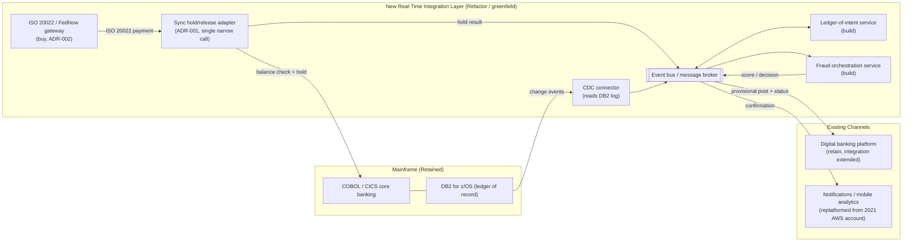

# Diagram: Target Architecture Style (Step 4)

Source of truth for the Step 4 target-style diagram referenced in `docs/architecture-options-and-styles.md`, ADR-001, and ADR-002. Rendered as Mermaid (diagrams-as-code, renders natively on GitHub) rather than a static image, so it stays in sync with the ADRs as they evolve. A hand-drawn version matching the visual style of Case Studies 1 and 3's PNG diagrams can be added alongside this later without replacing it as the source.

## How to read this diagram

- **Solid boxes inside "Mainframe"** are untouched, existing systems — nothing here changes.
- **The hold/release adapter** is the *only* synchronous path into the mainframe (ADR-001) — it exists purely to prevent a double-spend race condition at authorization time.
- **The CDC connector** is a one-way, read-only tap on the DB2 transaction log — it cannot write back to the mainframe, which is what makes it safe to run without touching COBOL logic.
- **The event bus** is the backbone of the new layer — every other new component talks through it, not directly to each other, which is what will let Steps 6–9 swap in different platform-specific messaging services (Azure Service Bus / Event Hubs, AWS EventBridge/Kinesis, GCP Pub/Sub, or an on-prem equivalent) without changing this shape.
- **The gateway is bought (ADR-002)**; the ledger-of-intent and fraud services are built in-house (ADR-002) — that distinction is why they're labeled separately even though they sit in the same layer.
