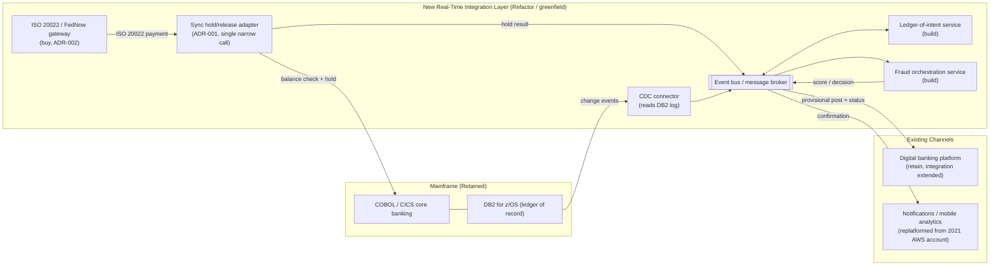

# Step 4: Architecture Options and Styles

## Framing the Question

Every option below is judged against the same five ranked drivers from `problem-statement.md`, and against the hard constraint in `requirements.md`: the COBOL/CICS core is not being rewritten or replaced in this initiative. That constraint eliminates an entire category of "obvious" answers (rip-and-replace the core) before this step even starts — which is itself the point of doing Step 1–3 first. What's left is a genuine design question: **how does a new, real-time capability attach itself to a batch-oriented system of record without either breaking that system or inheriting its latency and availability limits?**

## 6-R Disposition per Component

| Component | Disposition | Rationale |
|---|---|---|
| Core ledger (COBOL/CICS on DB2 for z/OS) | **Retain** | System of record; out of scope to replace (constraint in `requirements.md`); the initiative's entire premise is building around it, not on top of it. |
| Digital banking platform (vendor, on-prem VMware) | **Retain platform / Refactor integration** | The platform itself stays; only its mainframe integration is extended from batch-file-only to include a real-time path. |
| 2021 ad hoc AWS account (push notifications, mobile analytics) | **Replatform** | Workloads are sound; the problem is governance, not the workloads themselves. They move into the new governed landing zone this initiative builds — onto whichever platform Step 10 selects. |
| Real-time payments rail connectivity (FedNow / ISO 20022 messaging) | **Repurchase** | Rail certification and ISO 20022 message handling is a regulatory-heavy commodity capability; buying a certified gateway is faster and lower-risk than building one under an 18-month deadline (see [ADR-002](../adr/ADR-002-payment-hub-build-vs-buy.md)). |
| Fraud scoring and orchestration | **Refactor / re-architect (greenfield)** | No existing real-time capability to extend — this is new-build, but scoped as an orchestration layer around Palisade's own risk rules, not a full fraud platform rebuild. |
| Ledger-of-intent / mainframe integration adapter | **Refactor / re-architect (greenfield)** | New component; this is where Palisade-specific integration logic and value live (see [ADR-001](../adr/ADR-001-mainframe-integration-approach.md)). |
| Existing batch fraud stack | **Retire (partial)** | Retired specifically for the real-time-payments path once real-time scoring is live; retained as-is for ACH/wire and other rails that remain out of scope for this case study. |

## Integration Style Options (feeds [ADR-001](../adr/ADR-001-mainframe-integration-approach.md))

Four options were evaluated for how the new real-time capability attaches to the mainframe:

1. **Batch-file continuation with a cosmetic real-time front-end.** Keep the nightly batch interface as the only path to the ledger; give customers an optimistic, client-side "instant" UI that isn't actually posted until the overnight run. **Rejected** — this doesn't satisfy NFR-3 (true posting latency) or the underlying regulatory obligation: FedNow is a real settlement rail, not a UX layer, and Palisade would be non-compliant on day one.
2. **Full core replacement.** Replace COBOL/CICS/DB2 with a modern core banking platform capable of real-time posting natively. **Rejected** — directly violates the Step 3 constraint, and the 18-month timeline makes this infeasible regardless; a core conversion of this scope typically runs multiple years even at well-resourced banks.
3. **Direct synchronous API calls into CICS for every real-time posting**, via a mainframe API gateway (e.g., a CICS transaction gateway pattern). Technically well-established, but it couples the new real-time system's availability and latency directly to the mainframe's — including the nightly batch window, when the ledger is not available for live transaction posting. **Rejected as the sole mechanism** — it would put NFR-3 (5-second posting latency) and driver 5 (protect the batch window) in direct tension with each other every night.
4. **Change-data-capture (CDC) off the DB2 for z/OS transaction log, publishing an event stream, paired with a new ledger-of-intent that holds real-time posting state** until reconciled with the mainframe's batch-confirmed ledger. Fully decouples the real-time system from mainframe batch-window availability and touches no COBOL logic — but introduces eventual consistency between "provisionally posted" and "batch-confirmed," which has to be modeled explicitly (a customer needs to see *something* the instant a payment lands, and that something has to be honest about its own state).
5. **Hybrid: CDC out (as in option 4) plus one narrowly scoped synchronous call into CICS** — a balance check and funds hold at the moment of payment authorization only, using the same CICS API mechanism from option 3, but limited to this single, low-latency, already-well-understood transaction type rather than every posting. Everything downstream of the hold (event publishing, fraud scoring, ledger-of-intent update, customer notification) stays fully event-driven and decoupled.

**Selected: Option 5.** It is the only option that satisfies NFR-3 (real-time confirmation), NFR-5 (idempotent, exactly-once posting via hold + correlation ID), and driver 5 (batch window untouched, no COBOL rewrite) simultaneously. The full reasoning, rejected alternatives, and consequences are recorded in **[ADR-001](../adr/ADR-001-mainframe-integration-approach.md)**.

## Target Architecture Style (feeds [ADR-002](../adr/ADR-002-payment-hub-build-vs-buy.md))

Given the integration style above, the target style is an **event-driven integration layer** sitting between the mainframe and the outside world: a message broker carries payment-intent, fraud-decision, and ledger-of-intent events between a small number of purpose-built services, with the mainframe touched only via (a) the CDC feed reading its log and (b) the single synchronous hold/release call from [ADR-001](../adr/ADR-001-mainframe-integration-approach.md).

Within that style, a build-vs-buy question remains: does Palisade build the ISO 20022/FedNow rail connectivity itself, buy a commercial payment-hub product for the whole layer, or split the difference? This is decided in **[ADR-002](../adr/ADR-002-payment-hub-build-vs-buy.md)** — buy the certified rail-connectivity gateway (a compliance-heavy commodity), build the fraud-orchestration and ledger-of-intent/mainframe-adapter services in-house (where Palisade's own logic and integration needs are not generic).

*Diagram source: [`diagrams/target-architecture-style.md`](../diagrams/target-architecture-style.md) (Mermaid, renders natively on GitHub). A hand-drawn version to match the visual style of Case Studies 1 and 3 can be added later; this is the authoritative, version-controlled source in the meantime — consistent with the guide's own preference for diagrams-as-code.*

## What Step 4 Deliberately Leaves Open

Which cloud platform hosts this new integration layer (Azure, AWS, GCP, or a private-cloud/VCF footprint) is **not** decided here — that is the entire point of running all four implementation tracks in Steps 6–9 before the Step 10 decision matrix. Step 4 fixes the *shape* of the solution (integration style, component disposition, build-vs-buy split); Step 5 will restate that shape as a vendor-neutral logical design before any platform-specific service names enter the picture.
