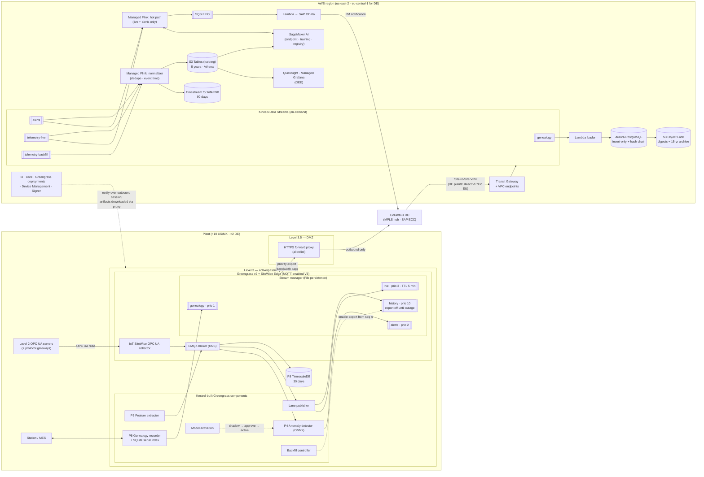

# Diagram: AWS Implementation Architecture (Step 7)

Reference source (Mermaid) for the Step 7 diagram in [`docs/aws-implementation.md`](../docs/aws-implementation.md) and [ADR-012](../adr/ADR-012-aws-edge-platform.md) to [ADR-017](../adr/ADR-017-aws-network-identity-and-deployment.md). A hand-drawn version will be produced from this source, as with the other case studies. The same shape is deployed in us-east-2 (US/MX plants) and eu-central-1 (Plants 11–12).

## How to read it

- **Stream manager is the outbox.** The four lanes are four native streams with export priorities. The only Kestrel code on the lane path is the backfill controller, which just turns the `history` export on and off ([ADR-013](../adr/ADR-013-aws-store-and-forward-implementation.md)).
- **The whole Level 3 box is an active/passive pair.** HA comes from Pacemaker/DRBD, not from AWS. This is the track's main operational risk ([ADR-012](../adr/ADR-012-aws-edge-platform.md)).
- **`telemetry-backfill` feeds only the normalizer, never the hot path,** so ADR-005 is enforced by wiring.
- **The dotted line from IoT Core** is a notification over the plant's own outbound session. Artifacts are downloaded by the device through the DMZ proxy ([ADR-017](../adr/ADR-017-aws-network-identity-and-deployment.md)).
