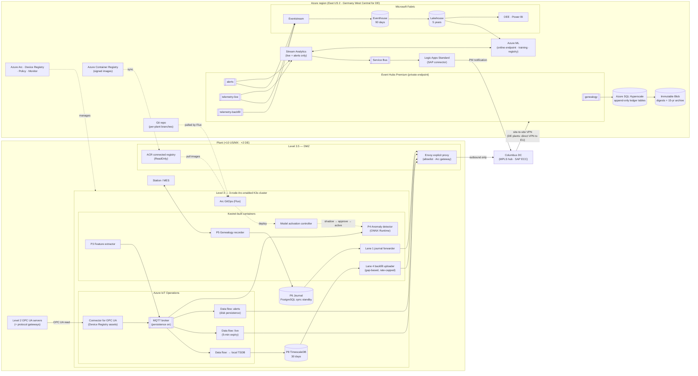

# Diagram: Azure Implementation Architecture (Step 6)

Source of truth for the Step 6 diagram referenced in [`docs/azure-implementation.md`](../docs/azure-implementation.md) and [ADR-006](../adr/ADR-006-azure-edge-platform.md) to [ADR-011](../adr/ADR-011-azure-network-identity-and-deployment.md). Mermaid renders natively on GitHub. The same shape is deployed in two regions: East US 2 for the 10 US/Mexico plants, and Germany West Central for Plants 11–12.

## How to read it

- **The Azure IoT Operations box** is what Microsoft provides at the edge. **The Kestrel-built box** is what Kestrel writes and operates. Their relative size is a Step 9 comparison point.
- **Four arrows leave the cluster, one per outbox lane,** and all go through the DMZ Envoy proxy. The backfill uploader reads from the local TimescaleDB, not from the broker ([ADR-007](../adr/ADR-007-azure-store-and-forward-implementation.md)).
- **`telemetry-backfill` feeds only Fabric, never Stream Analytics.** That is ADR-005 enforced by wiring.
- **The dotted lines are all pulls:** the connected registry syncs from ACR, Flux pulls from Git and the registry, and the activation controller gates models. Nothing in Azure initiates a connection into the plant ([ADR-011](../adr/ADR-011-azure-network-identity-and-deployment.md)).
- **P4 and P5/P6 have no arrow to Azure at runtime,** which is why the IoT Operations 72-hour offline ceiling does not reach alerting or genealogy ([ADR-006](../adr/ADR-006-azure-edge-platform.md)).
