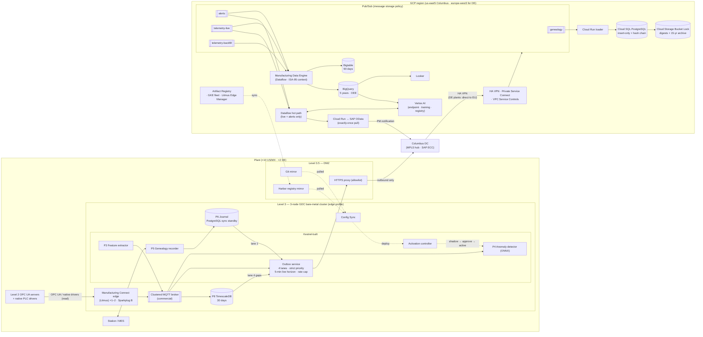

# Diagram: GCP Implementation Architecture (Step 8)

Reference source (Mermaid) for the Step 8 diagram in [`docs/gcp-implementation.md`](../docs/gcp-implementation.md) and [ADR-018](../adr/ADR-018-gcp-edge-platform.md) to [ADR-023](../adr/ADR-023-gcp-network-identity-and-deployment.md). A hand-drawn version will be produced from this source. The same shape is deployed in us-east5 (Columbus, for US/MX plants) and europe-west3 (Plants 11–12).

## How to read it

- **Three edge vendors in one box:** Google (the GDC cluster), Litmus (MCe), and the broker vendor. Everything in "Kestrel-built" is Kestrel's code, including the whole outbox ([ADR-018](../adr/ADR-018-gcp-edge-platform.md), [ADR-019](../adr/ADR-019-gcp-store-and-forward-implementation.md)).
- **MCe never talks to the cloud directly.** All plant-to-cloud traffic goes through the Kestrel outbox and the DMZ proxy, so no service-account key sits in the plant ([ADR-023](../adr/ADR-023-gcp-network-identity-and-deployment.md)).
- **The Dataflow hot path subscribes only to live and alerts.** MDE takes everything, including backfill, for storage.
- **The DMZ holds three mirrors and proxies** (proxy, Git, and registry), and the cluster pulls from all of them.
