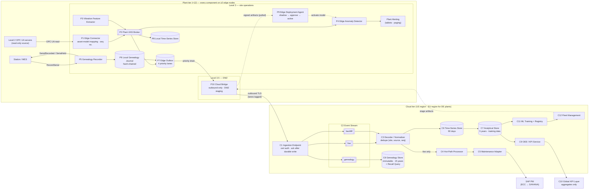
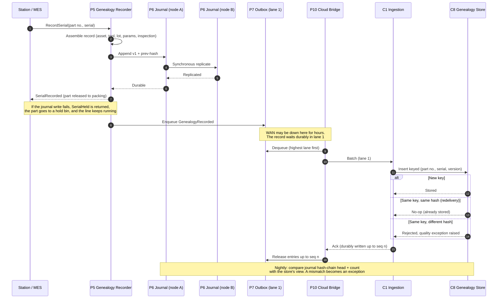

# Diagram: Logical Architecture (Step 5)

Source of truth for the Step 5 diagrams referenced in [`docs/logical-design.md`](../docs/logical-design.md), [ADR-004](../adr/ADR-004-genealogy-exactly-once-record-path.md), and [ADR-005](../adr/ADR-005-store-and-forward-and-backfill-lanes.md). Component numbers (P1–P10, C1–C13) match the tables in `logical-design.md`. Both diagrams are Mermaid, which renders natively on GitHub, and both are platform-neutral.

## 1. Logical component model

### How to read it

- **Only one arrow crosses the plant boundary outward**, from P10 to C1. The dotted arrow from C12 to P10 is *staging*: artifacts are placed in the DMZ and P9 **pulls** them. Nothing in the cloud opens a connection into the plant ([ADR-003](../adr/ADR-003-ot-segmentation-reference-architecture.md)).
- **Alerts never leave the plant to be raised.** P4 alerts locally (≤ 10 s) whether or not the WAN is up.
- **C3 feeds C4 from the live stream only.** Backfill goes to storage and OEE, never to the hot path ([ADR-005](../adr/ADR-005-store-and-forward-and-backfill-lanes.md)).
- **Genealogy has its own path end to end:** P5 → P6 → outbox lane 1 → genealogy stream → C8 ([ADR-004](../adr/ADR-004-genealogy-exactly-once-record-path.md)).
- C13 (Observability and Audit) consumes control events from every component. It is omitted from the drawing for readability.

## 2. Genealogy exactly-once path (ADR-004)

