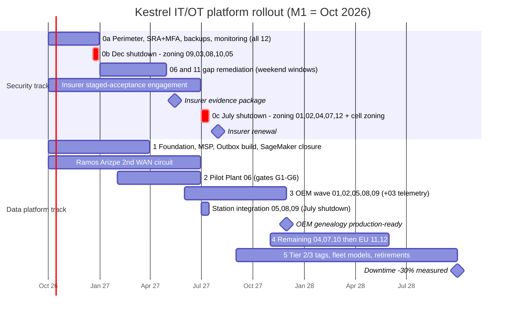

# Diagram: Migration Roadmap (Step 11)

Reference Gantt chart (Mermaid) for [`docs/migration-roadmap.md`](../docs/migration-roadmap.md) and [ADR-025](../adr/ADR-025-rollout-sequencing.md) to [ADR-027](../adr/ADR-027-coexistence-and-rollback.md). M1 = October 2026. The two shutdown bars are marked critical because they are the only windows for Level 0–2 changes. A hand-drawn version will be produced from this source.

## How to read it

- **The security track ends before the data platform reaches most plants.** No plant gets a cloud bridge before its DMZ and secure remote access (Phase 0a, done by December 2026).
- **The two red bars are the whole budget for control-network change** before the insurer renewal and the OEM deadline. That is why the December 2026 bar is used for the five highest-exposure plants and nothing else.
- **The OEM genealogy milestone (November 2027)** lands inside the Q4 2027 window with a month of margin. Phase 3 relies on the July 2027 shutdown for station integration at the non-MES OEM plants.
