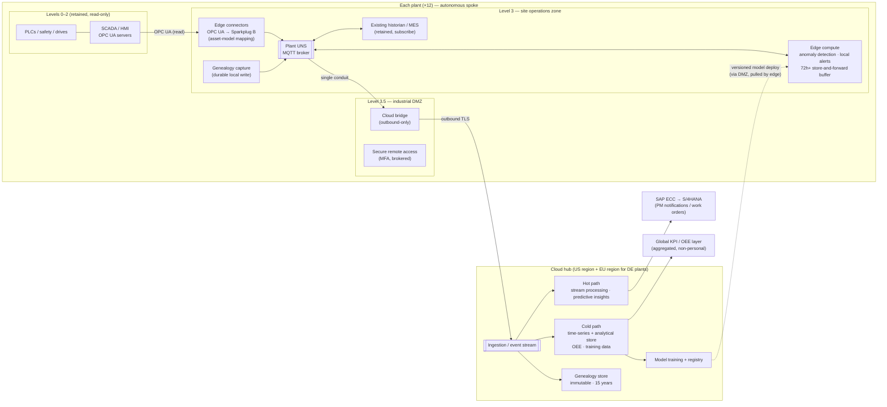

# Diagram: Target Architecture Style (Step 4)

Source of truth for the Step 4 target-style diagram referenced in [`docs/architecture-options-and-styles.md`](../docs/architecture-options-and-styles.md) and [ADR-001](../adr/ADR-001-edge-cloud-responsibility-split.md) to [ADR-003](../adr/ADR-003-ot-segmentation-reference-architecture.md). Mermaid renders natively on GitHub.

## How to read this diagram

- **Levels 0–2 are untouched.** The only arrow out of them is a *read* over OPC UA into the edge connectors. Nothing points back in.
- **The plant UNS broker is the hub inside each plant.** The historian, MES, edge analytics, and cloud bridge all subscribe to it instead of each connecting to the machines ([ADR-002](../adr/ADR-002-plant-data-integration-pattern.md)).
- **The DMZ is the only place the plant meets the outside.** The cloud bridge makes outbound connections only. Model deployments are *pulled* by the edge through the DMZ, not pushed in from the cloud ([ADR-003](../adr/ADR-003-ot-segmentation-reference-architecture.md)).
- **Everything in the plant box keeps working if the "outbound TLS" arrow is cut.** That is NFR-1, and it is why the edge compute holds the store-and-forward buffer ([ADR-001](../adr/ADR-001-edge-cloud-responsibility-split.md)).
- **The cloud box is platform-neutral on purpose.** Steps 6–8 swap in each platform's services for ingestion, stream processing, storage, and ML without changing this shape.
