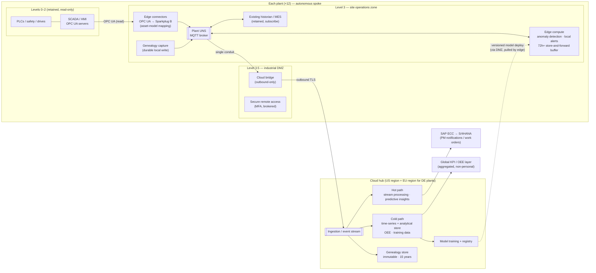

# Step 4: Architecture Options and Styles

## Framing the Question

Every option below is judged against the five ranked drivers in `problem-statement.md` and against two hard constraints in `requirements.md`:

- **Controls are out of scope.** PLCs, safety systems, and HMIs are read from, never rewritten or written to automatically.
- **Plants must run with no WAN or cloud** (NFR-1, NFR-2).

Those two constraints remove the "obvious" cloud-IoT answer before this step starts, namely devices streaming straight to a cloud hub that does all the thinking. What is left is a placement question with three parts:

- **What has to run inside each plant**, because it must survive a WAN outage or react in seconds?
- **What should run in the cloud**, because it needs data from all 12 plants or more compute than a plant can host?
- **How does data cross the boundary** between the two without creating a path back into the control network?

This case study is shaped differently from Case Studies 1–3. There, Step 4 mostly asked how to modernize one application. Here, no single application is being moved. The work is building a **data path** across 12 heterogeneous plants and deciding where each piece of logic lives along it.

## 6-R Disposition per Component

| Component | Disposition | Rationale |
|---|---|---|
| PLCs, safety systems, drives (Levels 0–1) | **Retain** | Out of scope by constraint. The platform reads process data through Level 2 OPC UA servers or protocol gateways, so it adds no new connections to controllers where that can be avoided. |
| SCADA/HMI servers and panels (Level 2) | **Retain + isolate** | Kept as-is. The two Windows 7 HMI plants (and other unpatchable Level 2 hosts) are not upgraded here, because that is controls work. They are contained instead: each is placed in its own IEC 62443 zone with a restrictive conduit, as a compensating control ([ADR-003](../adr/ADR-003-ot-segmentation-reference-architecture.md)). |
| Plant historians (AVEVA PI ×9, Wonderware ×1, Siemens-bundled ×1) | **Retain (local only)** | Plant engineers keep using them for local trending and troubleshooting. They are **not** the enterprise data path: the edge collects from the same OPC UA sources in parallel ([ADR-002](../adr/ADR-002-plant-data-integration-pattern.md)), so the enterprise design does not inherit five historian products' licensing, versions, and naming. Plant 05's legacy Wonderware is flagged for later retirement. |
| Plants with no historian (07, 10) | **(New) edge local store** | No historian is bought. The edge node's local time-series buffer (NFR-1's 72 hours, extended to 30 days locally) covers local trending. |
| Homegrown .NET MES (01, 02, 06) and commercial MES (11) | **Retain + integrate** | MES stays the system of record for work orders at those plants. It publishes serial and work-order events into the plant data layer instead of into nightly IDoc files only. |
| Paper travelers and the quality lab's lot-level database | **Replace (new build)** | The serial-level genealogy service is net-new. Nothing existing can be extended to serial resolution (driver 3). |
| Monthly handheld vibration routes (contractor) | **Repurchase for 300 critical assets / Retain for the rest** | Online wired and wireless vibration and temperature sensors replace the monthly route on the 300 critical assets, and features are computed at the edge. Non-critical assets stay on the route, since online sensors on all 2,400 assets would not pay back. |
| TeamViewer on HMIs and vendor cellular modems | **Retire → Repurchase** | Replaced by a brokered, MFA-enforced OT secure-remote-access product that terminates in the Level 3.5 DMZ, with session recording and time-boxed vendor access. This is a direct insurer condition. |
| Flat plant networks | **Re-architect** | IEC 62443 zones and conduits with an industrial DMZ at every plant ([ADR-003](../adr/ADR-003-ot-segmentation-reference-architecture.md)). |
| SAP ECC (PM module) | **Retain + integrate** | Maintenance notifications and work orders are raised through a supported SAP interface (not database writes), designed so the S/4HANA migration changes only an adapter. |
| Weekly spreadsheet OEE | **Retire** | Replaced by a single OEE definition calculated from plant-data events (driver 4). |
| 2024 SageMaker PoC account | **Retire the account / Refactor the model** | The spindle-failure model's approach and features are carried into the new platform's ML pipeline. The ungoverned account and its copy of Plant 01 historian data are retired and purged, whichever platform is selected. |

## Decision 1: Where Work Runs — Edge/Cloud Split (feeds [ADR-001](../adr/ADR-001-edge-cloud-responsibility-split.md))

Four placement models were evaluated:

1. **Cloud-centric, thin edge.** Plant gateways forward raw data to a cloud IoT hub, and all detection, storage, and analytics run in the cloud. **Rejected.** It fails NFR-1 outright: at Ramos Arizpe (19-hour worst-case outage) the plant would lose alerting and genealogy capture for the whole outage. It also cannot carry raw kHz vibration data over 50 Mbps links.
2. **Historian-centric.** Standardize on the existing historians (upgrade everything to one product) and replicate historian to cloud. **Rejected as the enterprise path.** It is attractive at first, because nine plants already run AVEVA PI. But it makes the historian vendor the enterprise data model, leaves two plants with nothing to replicate, does not address genealogy (historians store time series, not serial-level events with exactly-once semantics), and ties Kestrel's platform choice to one historian vendor's cloud connector. The historians are kept, just not as the backbone (see the 6-R table).
3. **Fully plant-local analytics.** Run everything, including model training and OEE, in each plant, with no cloud. **Rejected.** It gives up cross-plant learning, which is where predictive maintenance gets its value. A bearing model trained on one press has seen very few failures, while one trained on the same press type across plants has seen many. It would also put 12 compute clusters into plants with no IT staff, the exact "edge sprawl" risk named in `requirements.md`.
4. **Edge-first, cloud-for-scale.** Each plant runs an edge tier responsible for everything that must survive an outage or react in seconds: collection, normalization to the enterprise asset model, the 72-hour-plus store-and-forward buffer, fast anomaly detection on critical assets, local alerting, and the durable genealogy write. The cloud is responsible for everything that needs all plants or elastic compute: model training, fleet-wide KPIs and OEE, long-term retention, genealogy query and recall scoping, and SAP integration. Models are trained in the cloud and **deployed to** the edge.

**Selected: Option 4.** It is the only option that satisfies NFR-1 and NFR-2 (autonomy, no cloud in the control loop) while still delivering driver 2's cross-plant predictive maintenance and driver 4's comparable OEE. See **[ADR-001](../adr/ADR-001-edge-cloud-responsibility-split.md)**.

## Decision 2: How Plant Data Is Integrated (feeds [ADR-002](../adr/ADR-002-plant-data-integration-pattern.md))

Within each plant, three integration patterns were evaluated:

1. **Point-to-point connectors.** Each consumer (historian, MES, edge analytics, cloud bridge) connects directly to each data source. This is Kestrel's de facto pattern today. **Rejected.** Every new consumer adds new connections to the same OPC UA servers and PLCs. That increases load on Level 2 and multiplies firewall rules through the conduits [ADR-003](../adr/ADR-003-ot-segmentation-reference-architecture.md) is trying to keep narrow.
2. **Historian federation.** Consumers read through the historian's APIs. **Rejected** for the reasons given in Decision 1, option 2.
3. **Unified Namespace (UNS) per plant.** One MQTT broker per plant is the single hub where every producer publishes and every consumer subscribes. Topics follow an ISA-95 hierarchy (`kestrel/<site>/<area>/<line>/<asset>/<signal>`), and machine telemetry uses the Sparkplug B payload specification. OPC UA stays the collection protocol at Level 2. Edge connectors read OPC UA (or native drivers via protocol gateways) and publish into the UNS.

**Selected: Option 3.** Four reasons:

- **One connection per data source.** Collection happens once, and the historian, MES, edge analytics, and cloud bridge all subscribe to the broker rather than to the machines.
- **State awareness.** Sparkplug B's birth and death certificates tell consumers when a data source has gone offline, so the platform can tell "the value is zero" apart from "the data is stale." That difference matters for anomaly detection and for OEE (an offline sensor is not an idle machine).
- **The enterprise asset model gets enforced.** The topic hierarchy *is* the asset model, so the tag-naming debt from `requirements.md` is paid once, at the edge connector, and not by every consumer.
- **Portability.** MQTT, Sparkplug B, and OPC UA are open standards. If a cloud-side IoT service is retired (Google Cloud IoT Core in 2023 is the precedent), only the cloud side of the bridge changes. No plant is re-instrumented.

Genealogy events are the exception. They travel over the same UNS for local visibility, but their durable write follows the exactly-once path defined in Step 5, not Sparkplug's fire-and-forget telemetry semantics. See **[ADR-002](../adr/ADR-002-plant-data-integration-pattern.md)**.

## Decision 3: OT Segmentation and the Plant-to-Cloud Conduit (feeds [ADR-003](../adr/ADR-003-ot-segmentation-reference-architecture.md))

Four segmentation models were evaluated for the standard plant:

1. **VLANs only.** Separate VLANs for IT and OT, routed at the plant core switch. This is today's "partial" state at several plants. **Rejected.** VLANs without stateful policy enforcement between them are what the insurer and IEC 62443 are asking Kestrel to move beyond, and they do not create a conduit that can be monitored or controlled.
2. **Full air gap.** No connectivity between OT and anything else. **Rejected.** It is incompatible with the whole initiative, and in practice air gaps get bridged by USB sticks and vendor laptops, which moves the risk rather than removing it.
3. **Unidirectional gateway (data diode) as the standard plant-to-cloud conduit.** **Rejected as the default, kept as an option.** A hardware diode gives the strongest guarantee that nothing can flow back into the plant. But the edge-first model needs a small, controlled amount of inbound traffic at the DMZ: model and configuration deployment to edge nodes, and brokered remote access. A diode at the Level 2/3 boundary remains available for any zone a future risk assessment rates above Security Level 2.
4. **IEC 62443 zones and conduits with an industrial DMZ (Level 3.5).** Firewalled zones for cells and lines, supervisory, site operations, and DMZ. Every conduit is explicitly defined and default-deny. **All traffic between OT and outside the plant terminates in the DMZ.** The cloud bridge in the DMZ holds only outbound connections to the cloud, and it subscribes to the plant UNS broker, which sits one zone deeper, through a single defined conduit. Nothing outside the plant can open a connection into Levels 0–3. Remote access and edge deployments land in the DMZ and are brokered from there. Passive OT network monitoring covers every zone.

**Selected: Option 4.** It meets the insurer's conditions and NFR-9 directly, and it makes connecting to the cloud *tighten* each plant's security rather than loosen it. The cloud bridge becomes one more narrow, monitored conduit in a network that today has none. See **[ADR-003](../adr/ADR-003-ot-segmentation-reference-architecture.md)**.

## Target Architecture Style

Taken together, the three decisions give a target style of **edge-first, event-driven, hub-and-spoke**:

- **Spokes:** each plant is a self-sufficient hub, with its own UNS broker, edge compute, local buffer, and local alerting. It keeps working indefinitely if everything outside it disappears.
- **Hub:** the cloud platform receives every plant's event stream through one outbound conduit per plant and splits it into:
  - a **hot path** (stream processing for near-real-time predictive insights and SAP PM notifications, NFR-5's 5-minute target)
  - a **cold path** (time-series and analytical storage for OEE, training data, and the 90-day/5-year retention tiers)
  - a separate **genealogy store** (immutable, 15-year, queryable per serial number and for recall scoping)
- **Feedback loop:** models trained in the cloud are versioned and deployed back to edge nodes through the DMZ. They are never deployed directly to Level 2 and never make control decisions. They raise alerts and recommendations, and people act on them.
- **Regional split (NFR-10):** the German plants bridge to an EU cloud region, where their raw telemetry and genealogy stay. Only aggregated, non-personal KPIs flow to the global analytics layer. The hub is therefore really two regional hubs with one global reporting layer on top, which is a structural answer to residency rather than a policy bolted on afterwards.

*Diagram source: [`diagrams/target-architecture-style.md`](../diagrams/target-architecture-style.md) (Mermaid, which renders natively on GitHub). A hand-drawn version matching the other case studies can be added alongside it without replacing it as the source.*

## What Step 4 Deliberately Leaves Open

- **Platform.** Which cloud hosts the hub, and which edge software runs in each spoke, is not decided here. That is the purpose of Steps 6–8. Each hyperscaler has a different answer for the edge (and GCP has no first-party managed IoT service since 2023), so the edge layer is part of what each track is compared on.
- **Build versus buy for edge software.** Whether the edge tier is a hyperscaler's edge offering, an industrial edge vendor's platform, or open-source components (an MQTT broker plus containerized connectors) depends on the platform, so it is decided per track in Steps 6–8 and compared in Step 9.
- **Deferred to Step 5 (logical design):** the genealogy exactly-once write path, the store-and-forward/backfill design (NFR-4's 300K values/sec burst without starving live data), and the hot/cold path detail.
