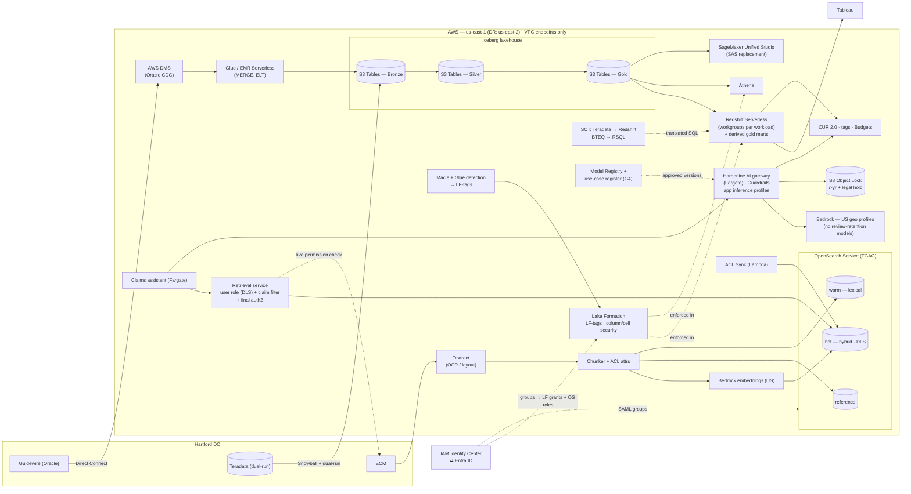

# Diagram: AWS-Track Implementation (Step 7)

Reference source (Mermaid) for [`docs/aws-implementation.md`](../docs/aws-implementation.md) and [ADR-015](../adr/ADR-015-aws-data-platform.md) to [ADR-020](../adr/ADR-020-aws-network-identity-finops.md). A hand-drawn version will be produced from this source.

## How to read it

- **Everything is AWS-native.** Unlike the Azure track, there is no cross-cloud data platform. The system of record is native Iceberg (S3 Tables), and Redshift holds only derived gold marts ([ADR-015](../adr/ADR-015-aws-data-platform.md)).
- **Identity Center groups (from Entra) drive both Lake Formation grants and OpenSearch roles.** The planes are aligned by identity rather than by one catalog ([ADR-016](../adr/ADR-016-aws-governance-plane.md)).
- **The OpenSearch hot index enforces document-level security itself**, on line, state, and Restricted. The retrieval service adds the claim-assignment filter and the final authorization check ([ADR-017](../adr/ADR-017-aws-retrieval.md)).
- **The AI gateway is Harborline-built** (AWS has no first-party enterprise LLM gateway). It calls Bedrock US geo profiles, excludes models that require review retention, and logs to Object Lock ([ADR-018](../adr/ADR-018-aws-models-and-ai-gateway.md)).
