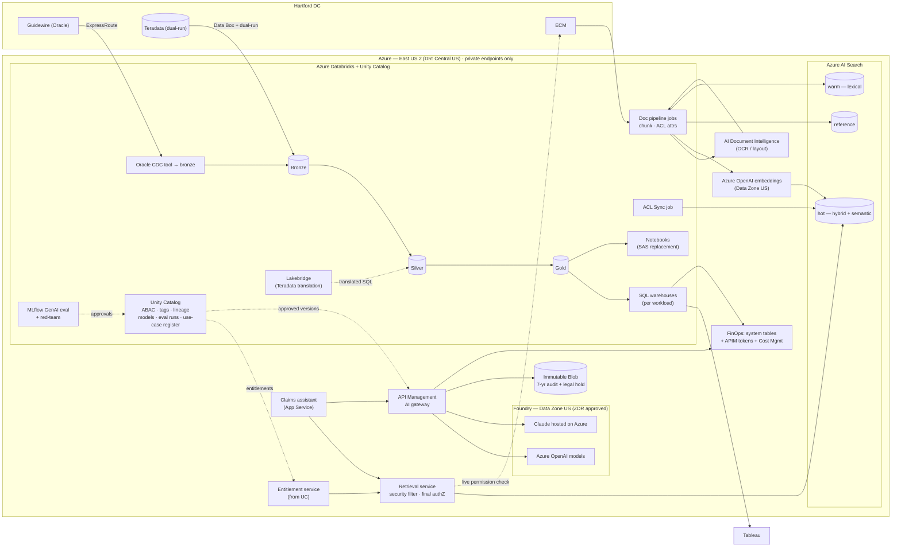

# Diagram: Azure-Track Implementation (Step 6)

Reference source (Mermaid) for [`docs/azure-implementation.md`](../docs/azure-implementation.md) and [ADR-009](../adr/ADR-009-azure-data-platform.md) to [ADR-014](../adr/ADR-014-azure-network-identity-finops.md). A hand-drawn version will be produced from this source.

## How to read it

- **Databricks and Unity Catalog are the data core.** Azure-native services surround it where they are stronger: AI Search, Foundry, API Management, and Document Intelligence ([ADR-009](../adr/ADR-009-azure-data-platform.md)).
- **Unity Catalog feeds the entitlement service**, so the AI Search security filter is derived from the same policy source as SQL masking. The index itself sits outside UC, which is the track's governance gap ([ADR-010](../adr/ADR-010-azure-governance-plane.md), [ADR-011](../adr/ADR-011-azure-retrieval.md)).
- **Every model call goes through API Management** to Foundry Data Zone US deployments. Claude is Azure-hosted, not Anthropic-hosted, and every call is logged to immutable storage ([ADR-012](../adr/ADR-012-azure-models-and-ai-gateway.md)).
- **Historical Teradata data arrives by Data Box**, while CDC and dual-run traffic use ExpressRoute ([ADR-014](../adr/ADR-014-azure-network-identity-finops.md)).
