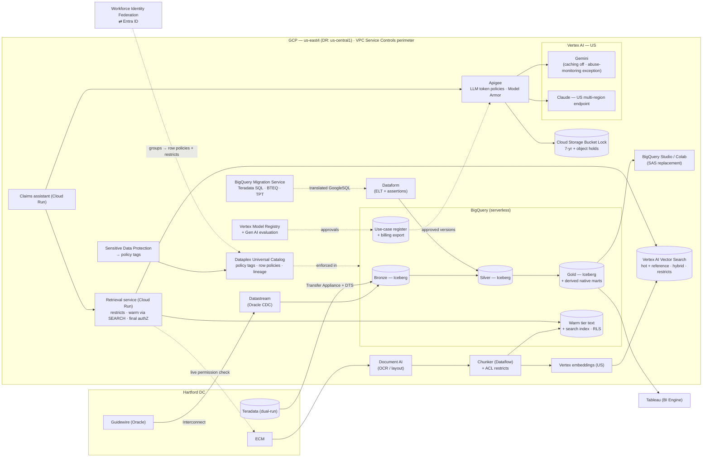

# Diagram: GCP-Track Implementation (Step 8)

Reference source (Mermaid) for [`docs/gcp-implementation.md`](../docs/gcp-implementation.md) and [ADR-021](../adr/ADR-021-gcp-data-platform.md) to [ADR-026](../adr/ADR-026-gcp-network-identity-finops.md). A hand-drawn version will be produced from this source.

## How to read it

- **BigQuery is the single serverless engine** for ELT, SQL, BI, notebooks, **and the warm retrieval tier**. The system of record is Iceberg-managed tables ([ADR-021](../adr/ADR-021-gcp-data-platform.md)).
- **The warm tier sits inside BigQuery**, so row-level security enforces permissions there. The hot tier (Vector Search) uses application-supplied restricts ([ADR-023](../adr/ADR-023-gcp-retrieval.md)).
- **Apigee is the bought AI gateway**, with Model Armor screening. Models are Gemini (caching disabled) and Claude on the US multi-region endpoint ([ADR-024](../adr/ADR-024-gcp-models-and-ai-gateway.md)).
- **The whole data and AI estate sits inside a VPC Service Controls perimeter** ([ADR-022](../adr/ADR-022-gcp-governance-plane.md)).
