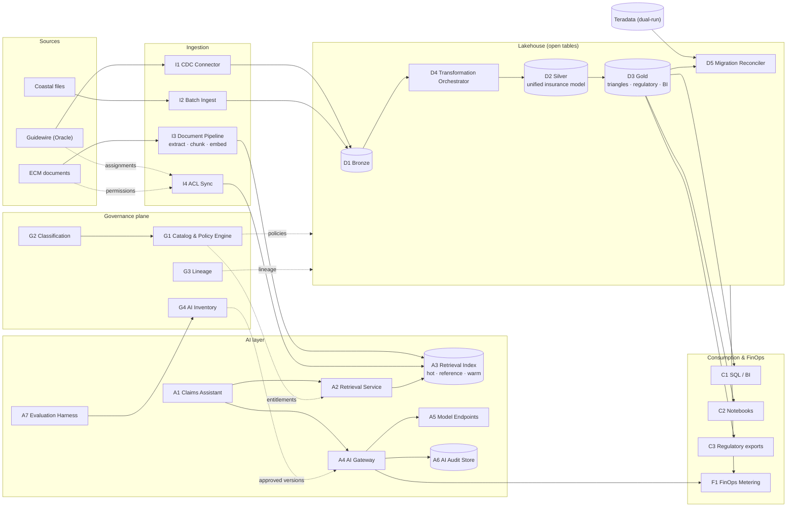
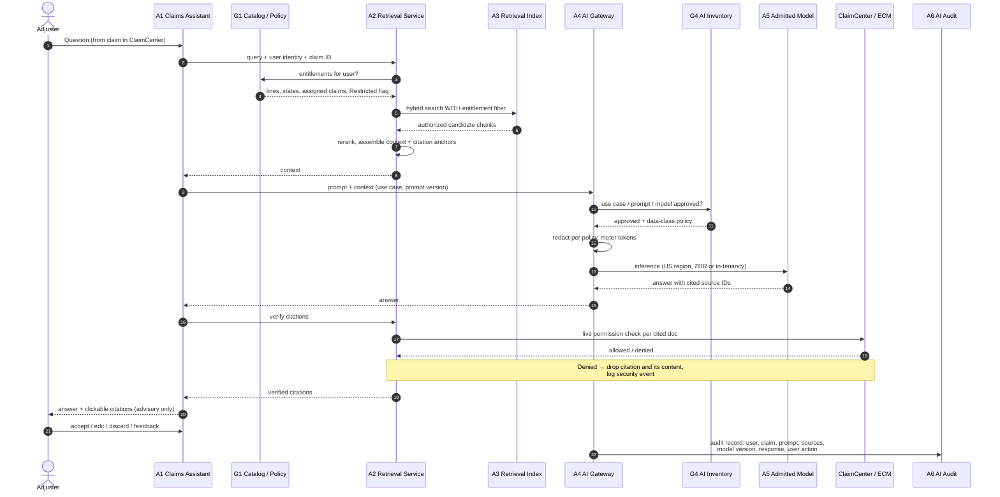

# Diagram: Logical Architecture (Step 5)

Reference sources (Mermaid) for [`docs/logical-design.md`](../docs/logical-design.md) and [ADR-006](../adr/ADR-006-retrieval-scope-and-chunking.md) to [ADR-008](../adr/ADR-008-finops-allocation-and-unit-cost.md). Component numbers match the table in `logical-design.md`. Hand-drawn versions will be produced from these sources. Both diagrams are platform-neutral.

## 1. Logical component model

### How to read it

- **ECM feeds only the index, never the lakehouse as content.** Documents stay in ECM, and the index holds chunks, embeddings, and ACL attributes ([ADR-006](../adr/ADR-006-retrieval-scope-and-chunking.md)).
- **I4 ACL Sync is a separate path from I3.** Permission changes update index metadata without re-embedding anything.
- **G4 gates A4:** the gateway only serves use cases, prompts, and models approved by the evaluation harness ([ADR-007](../adr/ADR-007-evaluation-and-release-gating.md)).
- **Everything that costs money reports to F1** ([ADR-008](../adr/ADR-008-finops-allocation-and-unit-cost.md)).

## 2. Flow A — Adjuster asks the assistant (sequence)

### How to read it

- **Steps 3–6: permissions are applied before search**, so unauthorized chunks are never candidates ([ADR-003](../adr/ADR-003-permission-aware-retrieval.md)).
- **Steps 10–11: the gateway refuses anything not approved in the AI Inventory.**
- **Steps 16–19: every cited document is re-checked against the live source system** before display. This catches ACL-sync lag.
- **The last step writes the complete record to the immutable audit store**, including what the adjuster did with the answer (NFR-6).
