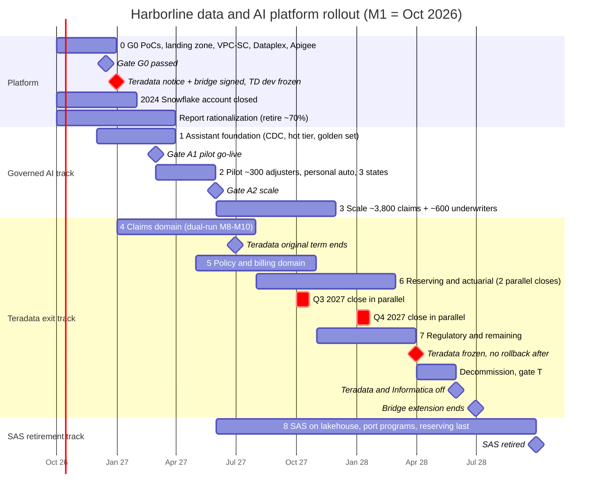

# Diagram: Migration Roadmap (Step 11)

Reference Gantt chart (Mermaid) for [`docs/migration-roadmap.md`](../docs/migration-roadmap.md) and [ADR-028](../adr/ADR-028-teradata-contract-and-exit-sequencing.md) to [ADR-030](../adr/ADR-030-domain-dual-run-and-rollback.md). M1 = October 2026. Red items mark the dates that cannot move: the Teradata notice, the two parallel reserving closes, and the freeze after which there is no rollback to Teradata. A hand-drawn version will be produced from this source.

## How to read it

- **The governed AI track doesn't depend on the Teradata track.** The assistant pilot goes live in March 2027 (M6), before the claims domain has even finished its dual-run. It needs ClaimCenter CDC, the document pipeline and the governance plane, not the warehouse ([ADR-029](../adr/ADR-029-decoupled-assistant-rollout.md)).
- **The December 2026 notice sits right after G0.** The notice is given on evidence from the translation proof of concept, and the bridge is signed at the same time ([ADR-028](../adr/ADR-028-teradata-contract-and-exit-sequencing.md)).
- **The original term end (June 2027) falls in the middle of the exit.** Only the claims domain is close to sign-off by then, which is why the bridge is needed.
- **Reserving is the critical path.** Its two parallel quarterly closes (October 2027 and January 2028) can't be compressed, and they push the Teradata freeze to March 2028 (M18).
- **Switch-off in May 2028 lands one month inside the bridge**, which ends in June 2028. That month is the only schedule margin on the exit track.
- **SAS retirement runs last.** Reserving models are ported only after the reserving domain signs off, and SAS is retired by September 2028 (M24).
