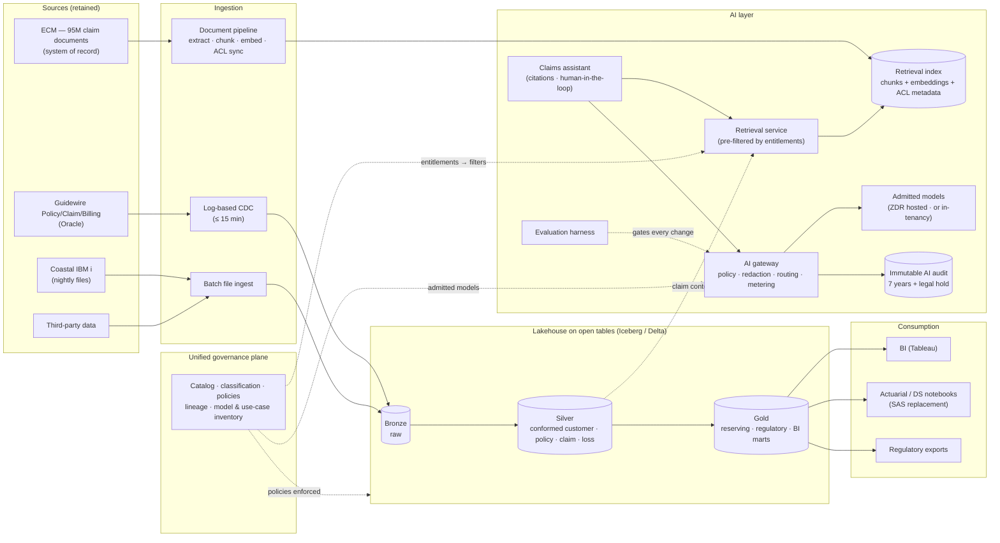

# Diagram: Target Architecture Style (Step 4)

Reference source (Mermaid) for the Step 4 diagram in [`docs/architecture-options-and-styles.md`](../docs/architecture-options-and-styles.md) and [ADR-001](../adr/ADR-001-lakehouse-on-open-tables.md) to [ADR-004](../adr/ADR-004-ai-gateway-and-model-access.md). A hand-drawn version will be produced from this source.

## How to read it

- **One copy of analytical data**, in open tables with a bronze → silver → gold layout ([ADR-001](../adr/ADR-001-lakehouse-on-open-tables.md)). The conformed insurance model lives in silver.
- **The governance plane's dotted lines reach everything**: the lakehouse, the retrieval service, and the AI gateway. Access rules are defined once ([ADR-002](../adr/ADR-002-unified-governance-plane.md)).
- **ECM stays the system of record for documents.** The index holds chunks, embeddings, and ACL metadata, and retrieval is filtered *before* search by the user's entitlements ([ADR-003](../adr/ADR-003-permission-aware-retrieval.md)).
- **Every model call goes through the AI gateway**, which writes the immutable audit trail and meters cost. The evaluation harness gates every change ([ADR-004](../adr/ADR-004-ai-gateway-and-model-access.md)).
- **Platform-neutral on purpose:** Steps 6–8 fill each box with native, Databricks, or Snowflake components on Azure, AWS, and GCP.
