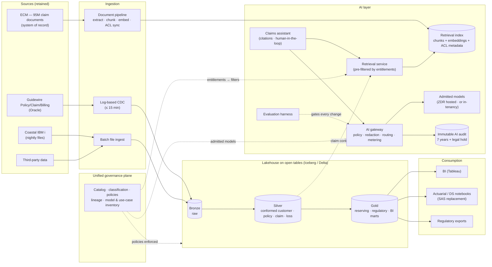

# Step 4: Architecture Options and Styles

## Framing the Question

Every option is judged against the five ranked drivers in `problem-statement.md` and the constraints in `requirements.md`: Guidewire stays, the Teradata dates are fixed, data stays in the US, and the assistant is retrieval with citations rather than an autonomous agent. It is also judged against the invariant: no automated adverse decision, and no training of anyone else's model on Harborline data.

Four design questions follow:

1. **Where does analytical data live, and in what format**, so that leaving Teradata does not simply swap one proprietary warehouse for another? ([ADR-001](../adr/ADR-001-lakehouse-on-open-tables.md))
2. **Where are access rules defined and enforced**, so that SQL, BI, notebooks, *and* the assistant all obey the same rules? ([ADR-002](../adr/ADR-002-unified-governance-plane.md))
3. **How does retrieval respect document permissions**, which is the most common way RAG systems leak? ([ADR-003](../adr/ADR-003-permission-aware-retrieval.md))
4. **How do applications reach models**, so that data-use terms, audit, and cost are enforced in one place? ([ADR-004](../adr/ADR-004-ai-gateway-and-model-access.md))

A fifth question, **how the Teradata estate itself is migrated**, is answered in [ADR-005](../adr/ADR-005-teradata-migration-approach.md). *When* it is migrated, including the bridge-extension decision, is left to Step 11.

## 6-R Disposition per Component

| Component | Disposition | Rationale |
|---|---|---|
| Guidewire PolicyCenter / ClaimCenter / BillingCenter | **Retain + integrate (CDC)** | Out of scope to replace. Log-based CDC from the Oracle databases meets NFR-7 (≤ 15 min) without changes to Guidewire. |
| Coastal legacy policy/claims (IBM i) | **Retain until decommission + ingest nightly** | Being retired in a separate program by 2028. Building CDC for a system with two years left is poor value. Nightly files are enough for analytics, and Coastal claim documents are indexed for the assistant like any others. |
| Enterprise content management (95M documents) | **Retain as the system of record + index** | Documents stay where they are. The retrieval layer holds *extracted text, chunks, embeddings, and ACL metadata*, never a second authoritative copy ([ADR-003](../adr/ADR-003-permission-aware-retrieval.md)). |
| Teradata EDW | **Replatform/refactor to a lakehouse on open tables** | Automated SQL translation plus re-layering into bronze/silver/gold. Stored procedures are translated or rewritten, not re-modeled wholesale ([ADR-005](../adr/ADR-005-teradata-migration-approach.md)). |
| Informatica PowerCenter (2,400 jobs) | **Retire** | Replaced by CDC and in-platform ELT (SQL transformations under version control). The ~30% of jobs with no consumer are deleted, not migrated. The vendor and regulator file feeds are re-implemented as governed exports. |
| Coastal SQL Server warehouse | **Retire** | Coastal data is sourced directly from its extracts into the lakehouse. |
| SAS 9.4 grid (~900 programs) | **Retire gradually (refactor to Python/SQL)** | Not on the critical path for the Teradata exit. During the transition, SAS reads from the lakehouse through connectors. Reserving models move last, after a parallel run. |
| Tableau (~60% of reports) | **Retain + rationalize** | Tableau stays. About 70% of reports (unused in 12 months) are retired before any migration effort is spent on them. |
| SSRS | **Retire** | The surviving SSRS reports are rebuilt in the chosen BI tool. |
| 2024 Snowflake account | **Retire or absorb (decided per platform)** | Under a Snowflake-based track, it is absorbed into governed accounts. Under any other, it is retired and its data purged. Either way it ceases to exist in its current ungoverned form. |
| Public AI tools (blocked) | **Replace** | The sanctioned claims assistant, delivered with governance, is the only durable fix for shadow AI. |
| *New:* governance plane, retrieval index, AI gateway, FinOps | **Build or buy (per platform, Steps 6–8)** | These capabilities don't exist today. |

## Decision 1: Analytical Platform Architecture (feeds [ADR-001](../adr/ADR-001-lakehouse-on-open-tables.md))

| Option | Assessment |
|---|---|
| 1. **Move to Teradata's cloud offering** | **Rejected.** It is the fastest exit from the hardware, but it keeps the proprietary format and pricing model that driver 3 exists to escape. It fails NFR-12. |
| 2. **Cloud warehouse with proprietary managed storage** as the system of record | **Rejected as the system of record.** It is excellent for SQL workloads, but it repeats the Teradata lesson at the storage layer. Several warehouses now read and write open tables, so the *engine* stays eligible; only its proprietary storage is ruled out. |
| 3. **Data lake plus a separate warehouse** (two copies) | **Rejected.** It means two copies, two security models, and two cost lines, with governance split across both, which is the opposite of driver 1. |
| 4. **Lakehouse on an open table format** (Apache Iceberg or Delta Lake), in a **medallion** layout (bronze raw, silver conformed, gold business-ready), with **more than one engine** able to read it | **Selected.** One copy of the data in an open format satisfies NFR-12. SQL, BI, notebooks (the SAS replacement), and retrieval pipelines all work against the same governed tables. |

**Iceberg or Delta is not decided here.** Both meet NFR-12 as long as a second engine can read the tables. The choice depends on the platform: some platforms are native to one format and can expose tables in the other. It is made per track in Steps 6–8.

## Decision 2: Where Governance Lives (feeds [ADR-002](../adr/ADR-002-unified-governance-plane.md))

| Option | Assessment |
|---|---|
| 1. **Per-tool governance** (warehouse grants, BI row-level security, application checks in the assistant) | **Rejected.** It means three or more places to define the same rule, and they drift apart. It is also exactly how the Teradata estate ended up with schema-wide PII access. |
| 2. **A unified governance plane** | **Selected.** One catalog holds data *and* AI assets (tables, documents, indexes, models, prompts). Classification tags (Restricted / Confidential / Internal) drive masking and row filters automatically. Policies are enforced by every engine that reads the data, the retrieval layer included. Identity is Entra ID throughout. |

The same catalog **is** the NAIC-bulletin **model and use-case inventory**, with lineage from source to report and to model. It is one system rather than a spreadsheet maintained alongside.

## Decision 3: Permission-Aware Retrieval (feeds [ADR-003](../adr/ADR-003-permission-aware-retrieval.md))

| Option | Assessment |
|---|---|
| 1. **Post-filter:** retrieve the top-k chunks, then drop the ones the user may not see | **Rejected.** A bug in the filter is a leak. Heavy filtering also starves results (the top-k are all removed and the answer degrades silently). |
| 2. **Separate indexes per permission group** | **Rejected.** Harborline's permissions combine line × state × claim assignment × Restricted entitlement. The index count would explode, and claim reassignment would mean moving documents between indexes. |
| 3. **Pre-filtered retrieval with ACL metadata on every chunk** | **Selected.** Each chunk carries its document's ACL attributes (line, state, claim ID and assigned unit, Restricted flag), synced from ClaimCenter/ECM within 15 minutes. At query time, the user's entitlements from the governance plane become a **filter applied inside the search** (filtered vector search plus lexical search). A **final authorization check** on every cited document against the source system runs before anything is shown. |

## Decision 4: How Applications Reach Models (feeds [ADR-004](../adr/ADR-004-ai-gateway-and-model-access.md))

| Option | Assessment |
|---|---|
| 1. **Applications call model APIs directly** | **Rejected.** Data-use policy, audit, redaction, and cost attribution would be re-implemented in every application, or skipped. |
| 2. **Consumer or public AI tools** under a policy | **Rejected.** This is the March 2026 incident with a memo attached. |
| 3. **An AI gateway that every model call goes through** | **Selected.** It handles authentication; policy (which data classes may reach which models); redaction where policy requires it; immutable logging of prompts, retrieved sources, model version, and response (NFR-6); per-use-case rate limits and cost attribution (NFR-11); model routing and fallback; and evaluation hooks. |

**Models are admitted to the gateway only if they meet NFR-4:**
- a provider-hosted model under contractual **no-training and zero-data-retention** terms, with processing in the US, or
- an open-weight model **hosted within Harborline's tenancy**

Prompts and the evaluation set are written to be **model-agnostic**, so that a model swap is an evaluation run, not a rewrite.

## Target Architecture Style

This gives a **governed lakehouse with a retrieval-augmented AI layer**, in five parts:

- **Ingestion:**
  - log-based CDC from Guidewire (≤ 15 min)
  - nightly files from Coastal
  - vendor feeds
  - **document ingestion** from ECM (text extraction, chunking, embedding, and ACL metadata)
- **Lakehouse:** bronze, silver, and gold on open tables, with the conformed customer, policy, claim, and loss model (driver 4) in silver.
- **Governance plane:** catalog, classification, policies, lineage, and the model and use-case inventory, enforced across every engine and the retrieval index.
- **AI layer:**
  - the claims assistant calls the **retrieval service**, which runs the pre-filtered search
  - model calls go through the **AI gateway**, which sends them to admitted models and writes to the **immutable AI audit store**
  - the evaluation harness runs on every change
- **FinOps:** tags on everything, unit-cost metering at the gateway and warehouse, and budgets and alerts.

*Diagram source: [`diagrams/target-architecture-style.md`](../diagrams/target-architecture-style.md) (a Mermaid reference source for the hand-drawn version).*

## What Step 4 Deliberately Leaves Open

- **Platform:** native versus Databricks versus Snowflake on each of Azure, AWS, and GCP is Steps 6–8. It is where the governance plane, open-format support, and model access differ most.
- **Iceberg or Delta**, the **vector index product**, and the **models** are all platform-dependent and decided per track.
- **Deferred to Step 5 (logical design):** the conformed data model, how ACL metadata stays in sync with claim reassignments, the assistant's request flow and evaluation loop, and FinOps metering points.
- **Deferred to Step 11:** Teradata migration *timing* and the bridge-extension decision.
