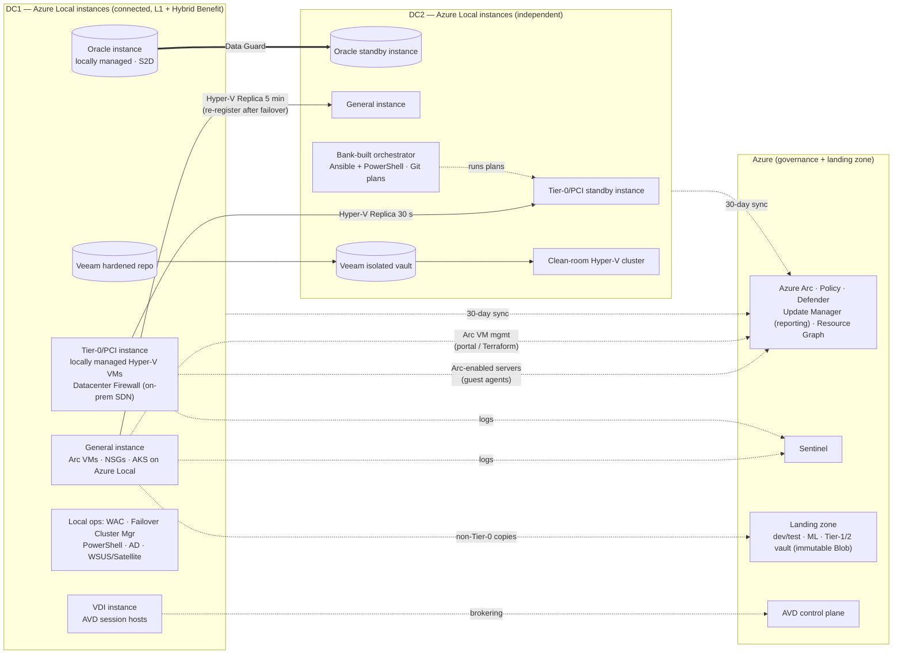

# Diagram: Azure Local + Azure Arc Track (Step 7)

Reference source (Mermaid) for [`docs/azure-implementation.md`](../docs/azure-implementation.md) and [ADR-015](../adr/ADR-015-azure-local-instance-topology.md) to [ADR-020](../adr/ADR-020-azure-vdi.md). A hand-drawn version will be produced from this source.

## How to read it

- **Two kinds of VM on one platform.** Tier 0 and Oracle are **locally managed Hyper-V VMs**: they are operated from the "Local ops" box and reach Azure only through guest agents (dotted). Tier 1 and Tier 2 are **Arc-managed**, and their lifecycle runs through Azure. That split is how this track meets the invariant ([ADR-016](../adr/ADR-016-azure-tier0-local-management-mode.md)).
- **Every dotted line to Azure can be cut for a week without stopping Tier 0.** The 30-day sync only blocks *new* VMs. VDI brokering and Tier-1/2 lifecycle degrade, and both are acceptable for Tier 1.
- **The orchestrator in DC2 is bank-built,** because there is no packaged on-premises DR orchestrator for Azure Local ([ADR-017](../adr/ADR-017-azure-recovery.md)).
