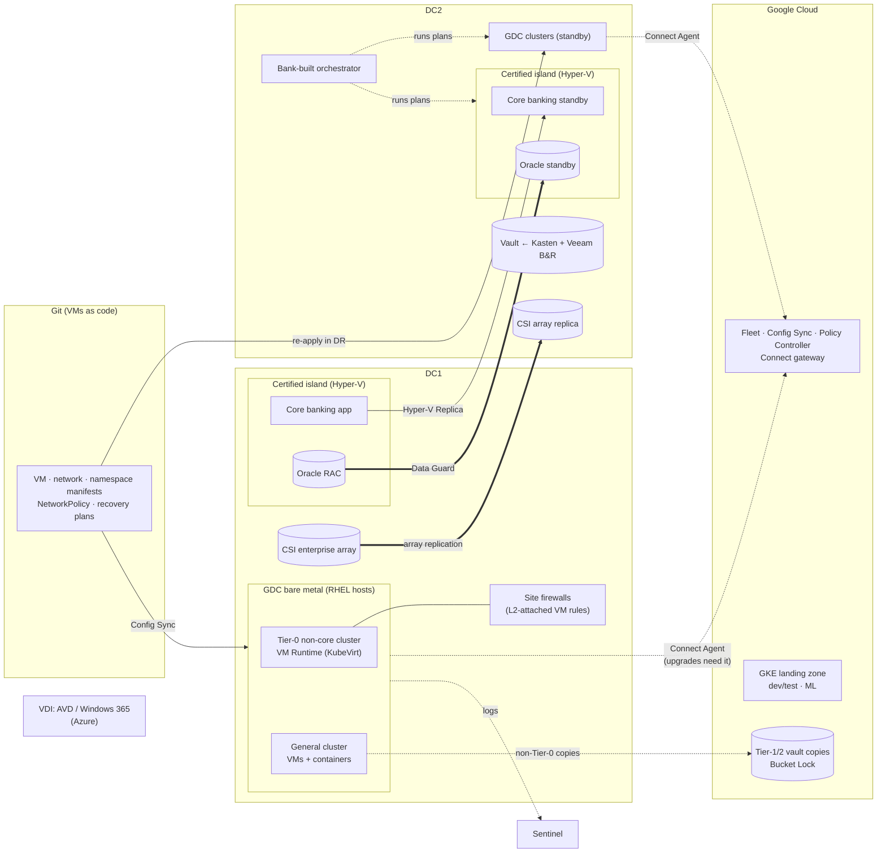

# Diagram: Google Distributed Cloud Track (Step 8)

Reference source (Mermaid) for [`docs/gcp-implementation.md`](../docs/gcp-implementation.md) and [ADR-021](../adr/ADR-021-gcp-gdc-cluster-topology.md) to [ADR-025](../adr/ADR-025-gcp-governance-delivery-and-vdi.md). A hand-drawn version will be produced from this source.

## How to read it

- **Two platforms in each site.** GDC runs everything the vendors support on KVM. The **certified island** (Hyper-V) runs core banking and Oracle, because the core vendor doesn't certify KVM ([ADR-022](../adr/ADR-022-gcp-certified-island.md)).
- **Git is the platform.** VMs, networks, and policies are manifests that Config Sync reconciles. In DR, the same manifests are re-applied to DC2 while the array replicas are promoted ([ADR-023](../adr/ADR-023-gcp-recovery.md)).
- **The Connect Agent line can be cut for a week, and VMs keep running and can be operated locally.** Cluster upgrades and node additions wait until it returns.
- **VDI sits in a third vendor's cloud** (Azure), because Horizon doesn't support KubeVirt.
