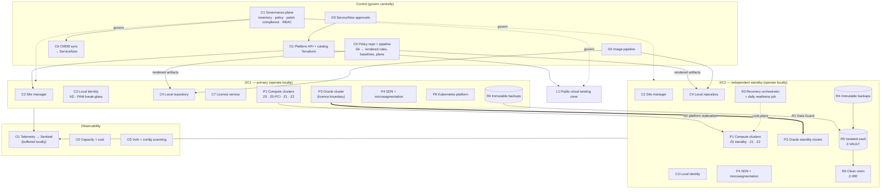
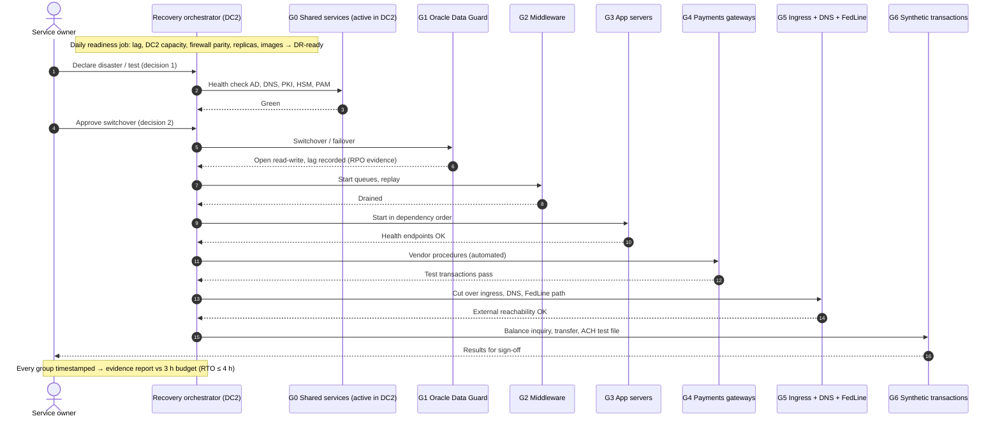

# Diagram: Logical Architecture (Step 5)

Reference sources (Mermaid) for [`docs/logical-design.md`](../docs/logical-design.md) and [ADR-006](../adr/ADR-006-recovery-plan-model-and-readiness.md) to [ADR-008](../adr/ADR-008-zone-model-and-segmentation-as-code.md). They are platform-neutral: component IDs (P, C, D, R, O, L) match the table in `logical-design.md`, and Steps 6–9 map them onto each platform. Hand-drawn versions will be produced from these sources.

## 1. Component Model

**How to read it:** everything inside the two site boxes is on the **local-autonomy contract**, meaning it must keep working with no cloud control plane. The control box *governs* (dotted lines) and *publishes rendered artifacts* into each site's local repository, but no Tier-0 operation depends on reaching it.

## 2. Tier-0 Recovery-Plan Sequence

**How to read it:** the service owner makes only two decisions (declare, approve). Everything else is executed and timestamped by the orchestrator in DC2, which is why the plan works with DC1 gone. Each arrow pair is a gate: the next group doesn't start until the previous one reports healthy.
