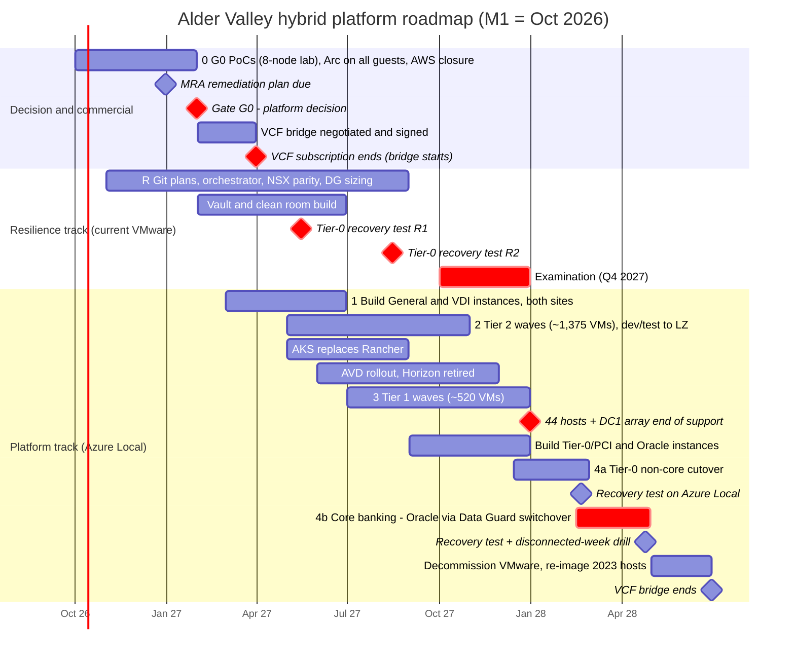

# Diagram: Migration Roadmap (Step 12)

Reference Gantt chart (Mermaid) for [`docs/migration-roadmap.md`](../docs/migration-roadmap.md) and [ADR-032](../adr/ADR-032-vcf-bridge-term.md) to [ADR-034](../adr/ADR-034-wave-plan-and-tier0-cutover.md). M1 = October 2026. Red items are the dates that can't move. A hand-drawn version will be produced from this source.

## How to read it

- **The resilience track produces the examination evidence on VMware** (R1 in May 2027, R2 in August 2027), before the examination window. It doesn't depend on the migration ([ADR-033](../adr/ADR-033-mra-evidence-before-tier0-migration.md)).
- **The platform track is paced by the December 2027 hardware end of support.** Tier 2 and Tier 1 have left the old hosts by then.
- **Tier 0 moves only after the examination**, non-core first and then core banking by Data Guard switchover, with two recovery tests on Azure Local before VMware is switched off.
- **The bridge ends in June 2028, one month after decommission.** That month is the schedule margin, and ADR-032's fallback is a 12-month term plus a 3-month extension.
