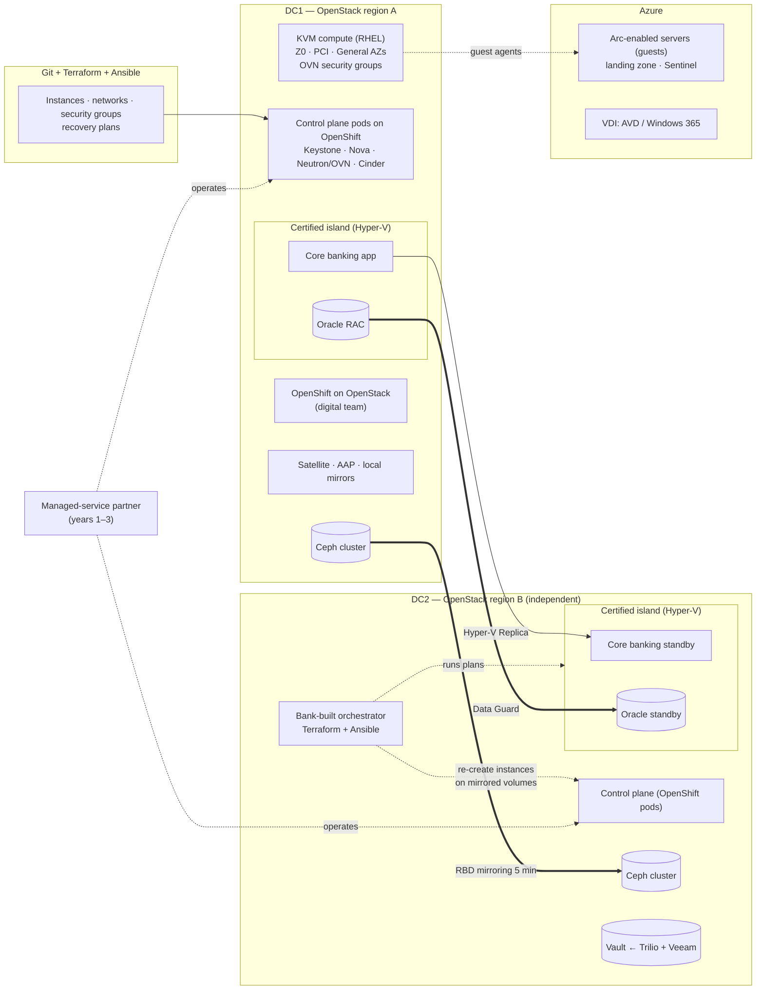

# Diagram: OpenStack Track (Step 9)

Reference source (Mermaid) for [`docs/openstack-implementation.md`](../docs/openstack-implementation.md) and [ADR-026](../adr/ADR-026-openstack-distribution-and-topology.md) to [ADR-030](../adr/ADR-030-openstack-operating-model-backup-and-vdi.md). A hand-drawn version will be produced from this source.

## How to read it

- **Nothing in either site needs a vendor cloud to operate.** The control planes, mirrors, and identity are all local, and a lapsed subscription removes support, not operations. This is the strongest disconnected-week result of the four tracks.
- **The island is the cost of KVM.** As on the GDC track, core banking and Oracle stay on certified Hyper-V ([ADR-027](../adr/ADR-027-openstack-certified-island-and-recovery.md)).
- **Recovery re-creates rather than replicates instances.** Ceph mirrors the volumes, and Terraform re-creates the instances in region B on the mirrored volumes.
- **The partner box is part of the design, not an afterthought** ([ADR-030](../adr/ADR-030-openstack-operating-model-backup-and-vdi.md)).
