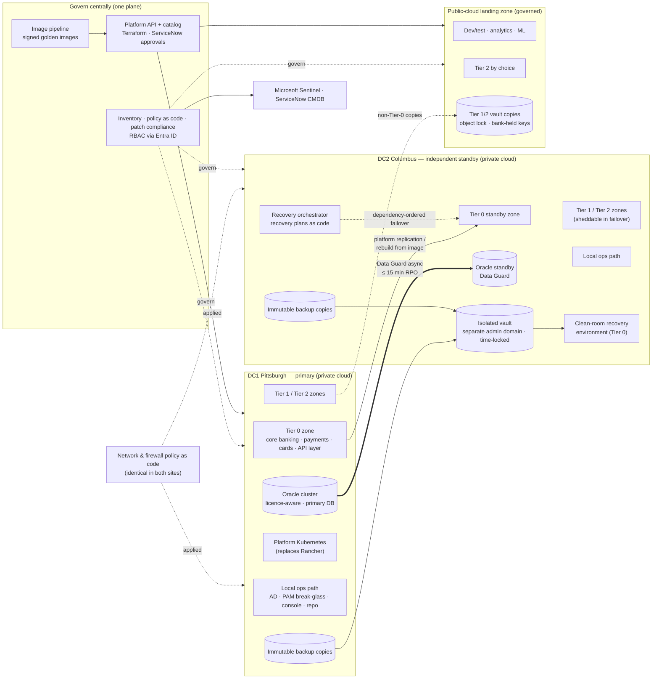

# Diagram: Target Architecture Style (Step 4)

Reference source (Mermaid) for the Step 4 diagram in [`docs/architecture-options-and-styles.md`](../docs/architecture-options-and-styles.md) and [ADR-001](../adr/ADR-001-platform-strategy-and-workload-placement.md) to [ADR-005](../adr/ADR-005-platform-api-and-portability.md). It is platform-neutral: Steps 6–9 map each box onto VCF, Azure Local + Arc, Google Distributed Cloud, or OpenStack. A hand-drawn version will be produced from this source.

## How to read it

- **The two sites are independent.** DC2 is not a stretched extension of DC1. It has its own clusters, its own local operations path, and the recovery orchestrator. Only data crosses between the sites: Oracle Data Guard, platform replication, and backup copies ([ADR-002](../adr/ADR-002-recovery-as-code-active-standby.md)).
- **Dotted "govern" lines are the central plane.** It sets policy, inventory, patch compliance, and access across both sites and the public-cloud landing zone. **None of the solid operational paths runs through it**, which is the invariant expressed as a picture ([ADR-004](../adr/ADR-004-govern-centrally-operate-locally.md)).
- **Network policy is generated once and applied to both sites.** That removes the firewall drift that broke the May 2026 failover.
- **The vault and the clean room are in DC2, behind their own administrative domain** ([ADR-003](../adr/ADR-003-cyber-recovery-vault-and-isolated-recovery.md)). Only non-Tier-0 vault copies go to the public cloud.
