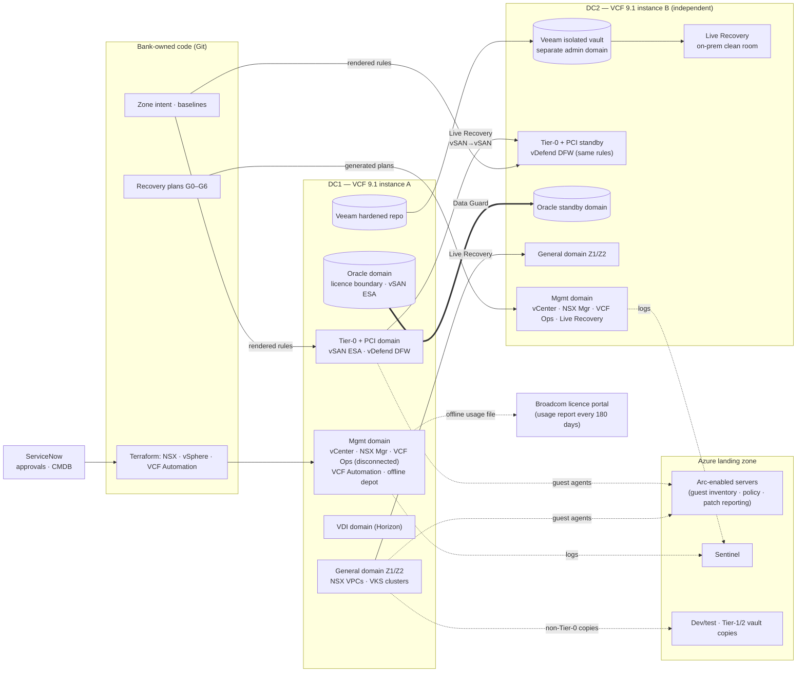

# Diagram: VCF Track Implementation (Step 6)

Reference source (Mermaid) for [`docs/vcf-implementation.md`](../docs/vcf-implementation.md) and [ADR-009](../adr/ADR-009-vcf-platform-and-domain-design.md) to [ADR-014](../adr/ADR-014-vcf-cloud-extension.md). A hand-drawn version will be produced from this source.

## How to read it

- **Two independent VCF instances.** Each site has its own management domain, so DC2 can operate and recover with DC1 gone. Only data crosses between them: Data Guard, Live Recovery replication, and backup copies.
- **Git is the source; the platforms receive rendered artifacts.** Zone rules go to both sites' vDefend firewalls, and recovery plans are generated into Live Recovery in DC2.
- **Azure sees guests, not the platform.** Arc-enabled vSphere doesn't support vCenter 9, so governance reaches Azure through guest agents (Arc-enabled servers).
- **The dotted line to Broadcom is the licence obligation.** A usage file goes out at least every 180 days. If it doesn't, or if the subscription lapses, workload operations stop ([ADR-012](../adr/ADR-012-vcf-control-plane-and-governance.md)).
